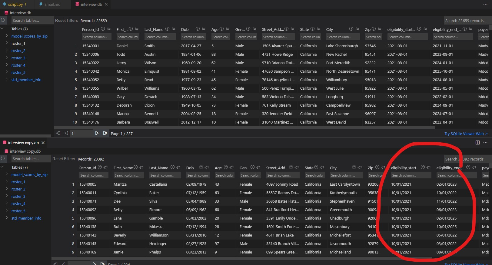

## Email to Project Manager

### To: Project Manager <project-manager@company.com> 
### From: Tim Ellis <tim.m.ellis@gmail.com>
### Subj: Roster Data Analysis for members eligible Apr 2022
---

Good morning [project manager],

I'm happy to report that I was able to combine the data from all 5 member rosters you sent, filter for members whose elibigility was active as of April, 2022, and provide the analysis that you requested. 

For the most part, this was a relatively straightforward process: For each roster, I limited my search to those members whose eligibility start/end dates were on either side of '2022-04-01', which guarantees they were eligible in April, 2022. Because there were some duplicate entries across the 5 rosters, I later sorted the data even further to include only **distinct** member id entries, so all of the analysis should reflect a true roster of unique members, (i.e. without duplicates, which would have potentially skewed counts and averages). I've included the difference in total entries versus unique entries below to give you some idea of what I mean.

I did find one small hiccup with the data: While the database expects dates to be stored in the format *"YYYY-MM-DD"*, all of the dates in the "roster_2" table were stored in the format *"MM/DD/YYYY"*. This required a small workaround in which I reformatted the data in the original "roster_2" table to the correct date format, and *then* I pulled out members from April, 2022. 

I assumed it was okay to manipulate the raw data in this way, since the original file was emailed to me and could therefore be recovered if needed. Still, in the future we should try to ensure that dates are formatted correctly on the user's end before being stored in our rosters, if at all possible.

Below, please find the data analysis requested. Please note that in the interest of member confidentiality, I recorded each member by id number only; if you require further identifying information, that can be included.  If you have any further questions, please don't hesitate to reach out!

*****************************
**IMPORTED DATA SUMMARY**

There are 122834 entries for members eligible in April, 2022. This includes:
* 90420 distinct members.
* 32414 duplicate entries.

**************************
**BREAKDOWN BY PAYER**
| - | Payer | Members | pct (%) |
| --- | ----- | ----- | ----- |
| 0 |  Madv | 33930 | 37.52 |
| 1 | Mdcd | 56490 | 62.48 | 

**************************************
**ANALYSIS BASED ON MODEL SCORES**

Members with 'Food Access Score' less than 2.0:
* *There are 6958 members residing across 136 zip codes with a 'Food Access Score' less than 2.0.*

Average 'Social Isolation' score for all distinct members
* *The average social isolation score for all distinct members is 3.0699.*

Algorex SDOH Composite Score:
 * *40 members live in the zip code with the highest algorex_sdog_composite_score:*

| -  | member_id |
| -  | ----- |
| 0  | 15404143 |
| 2  | 15363143 |
| 1  | 15537550 |
| 3  | 15375855 |
| 4  | 15359217 |
| 5  | 15447186 |
| 6  | 15487938 |
| 7  | 15493624 |
| 8  | 15506131 |
| 9  | 15387928 |
| 10 | 15389759 |
| 11 | 15403845 |
| 12 | 15459547 |
| 13 | 15495072 |
| 14 | 15499581 |
| 15 | 15525968 |
| 16 | 15355184 |
| 17 | 15370952 |
| 18 | 15377751 |
| 19 | 15468254 |
| 20 | 15469273 |
| 21 | 15516212 |
| 22 | 15531858 |
| 23 | 15534578 |
| 24 | 15476293 |
| 25 | 15348534 |
| 26 | 15377622 |
| 27 | 15383576 |
| 28 | 15456488 |
| 29 | 15460500 |
| 30 | 15484118 |
| 31 | 15502702 |
| 32 | 15456560 |
| 33 | 15340102 |
| 34 | 15346807 |
| 35 | 15389381 |
| 36 | 15482255 |
| 37 | 15484216 |
| 38 | 15486908 |
| 39 | 15489640 |